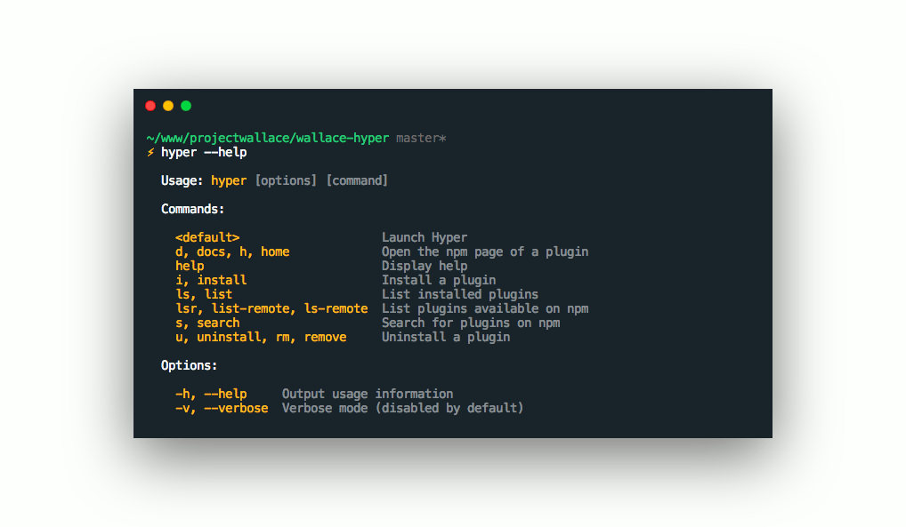

# hyper-wallace

[](https://www.projectwallace.com/oss)

Hyper theme based on [Project Wallace](https://www.projectwallace.com)



## Install

```sh
hyper install hyper-wallace
```

## Credits

This theme is mostly a copy from the *beautiful* [hyper-snazzy theme](https://github.com/sindresorhus/hyper-snazzy) by [Sindre Sorhus](https://github.com/sindresorhus).
